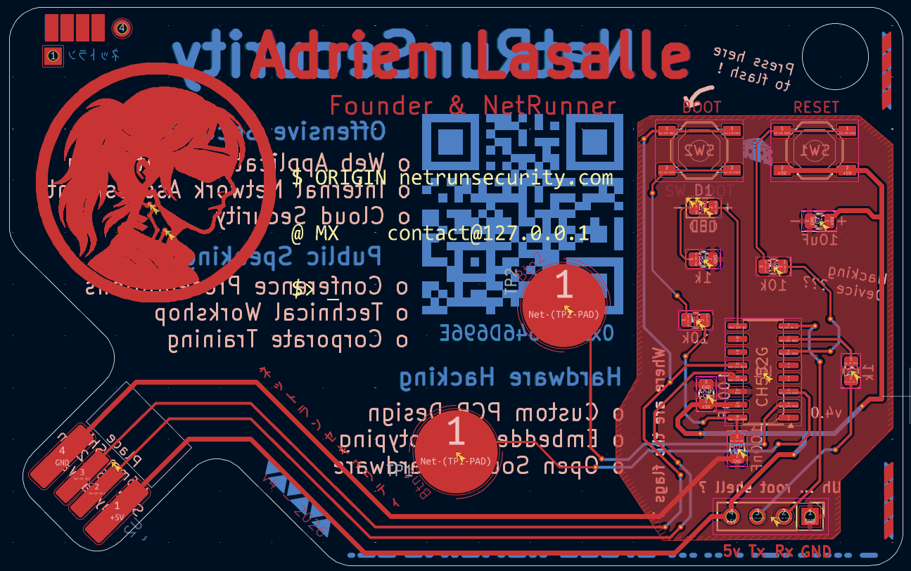
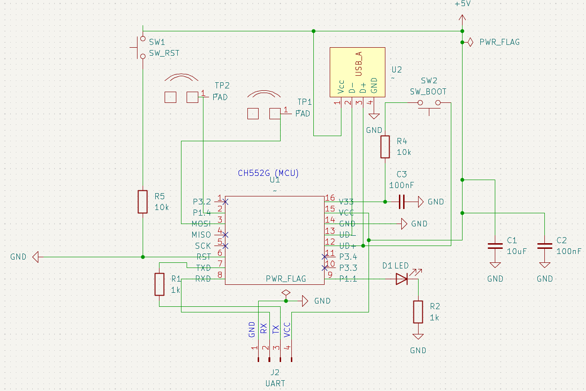

# USB Business Card (CH552G)

A real, working USB business card. It's shaped like a card, but the bottom edge is
cut into a USB-A male connector, plug it straight into any port, no cable, no
adapter. Powered by a **CH552G** with **native USB** (no USB-to-serial bridge chip),
two **capacitive touch** pads, a status LED, and a UART debug header.

It's a business card, a hacking tool, and a flex in one.

📖 Full build write-up, schematics and pinout:
**<https://wiki.netrunsecurity.com/electronics/sao/business-card/>**

---

## What's in this repo

```
.
├─ hardware/
│  ├─ card/
│  │  ├─ v4/          # current editable KiCad design (source of truth)
│  │  └─ v3/          # validated production build, gerbers only
│  └─ shim/           # USB-tab PCB shim (KiCad source + gerbers)
├─ firmware/
│  ├─ rubber-ducky/   # HID keystroke injection (opens a URL on plug-in)
│  ├─ touchpad-testing/ # capacitive Touch-Key + LED demo
│  ├─ ctf/            # USB serial CLI with hidden flags
│  └─ usb-uart-bridge/ # USB ↔ UART bridge for debugging IoT targets
├─ docs/              # photos, schematic PDF, fabrication files (BOM)
├─ LICENSE            # TAPR OHL 1.0, hardware
└─ firmware/LICENSE   # GPL-3.0, firmware
```

## Versions

| Version | Status | Files |
| --- | --- | --- |
| **V3** | Soldered & tested, the build in the photos | Gerbers (archived) |
| **V4** | Same circuit, current revision | Full KiCad sources |

V3 and V4 are **electrically identical**. R6 was a redundant RST pull-down (R5
already pulls RST to VCC) and was left unpopulated on V3, so it never affected the
circuit. V4 removes the footprint to prevent accidental population and updates the
silkscreen text. The V4 sources faithfully represent the validated V3 build.

> ⚠️ The original `v00110100` board had a reversed USB edge-connector polarity that
> destroyed chips on plug-in. **Do not fabricate that revision.** Use V3/V4.

## Hardware

- **MCU:** WCH CH552G (8051 core, native USB)
- **USB:** PCB-edge USB-A male connector, no bridge IC
- **Input:** 2× capacitive Touch-Key pads (read through the solder mask)
- **Indicator:** status LED
- **Debug / flash:** 1×4 UART header + BOOT/RESET buttons
- **Mechanical:** card + glued USB-tab shim (~2.4 mm total) for a snug USB-A fit
- **EDA:** KiCad



## Bill of Materials

| Ref | Qty | Value / Part | Package | MPN | LCSC |
| --- | --- | --- | --- | --- | --- |
| U1 | 1 | CH552G — 8-bit USB MCU | SOP-16 | CH552G | [C111292](https://www.lcsc.com/product-detail/C111292.html) |
| C1 | 1 | 10 µF 16 V X5R | 0805 | CL21A106KOQNNNE | [C1713](https://www.lcsc.com/product-detail/C1713.html) |
| C2, C3 | 2 | 100 nF 50 V X7R | 0805 | CC0805KRX7R9BB104 | [C49678](https://www.lcsc.com/product-detail/C49678.html) |
| R1, R2 | 2 | 1 kΩ 1% | 0805 | 0805W8F1001T5E | [C17513](https://www.lcsc.com/product-detail/C17513.html) |
| R4, R5 | 2 | 10 kΩ 1% | 0805 | 0805W8F1002T5E | [C17414](https://www.lcsc.com/product-detail/C17414.html) |
| D1 | 1 | Red LED 630 nm | 0805 | NCD0805R1 | [C84256](https://www.lcsc.com/product-detail/C84256.html) |
| SW1, SW2 | 2 | Tactile switch SPST | SMD 5.2×5.2 mm | TL3342F260QG | [C2886894](https://www.lcsc.com/product-detail/C2886894.html) |
| J2 | 1 | 1×4 pin header 2.54 mm (UART) | THT | HX PH254-01-04 | [C52016392](https://www.lcsc.com/product-detail/C52016392.html) |

> R6 is not populated (removed in V4). TP1/TP2 are copper touch pads and U2 is the
> PCB-edge USB connector — neither is a placed part.



## Firmware

Several firmwares, each demoing a different capability of the platform:

- **rubber-ducky**: enumerates as a USB keyboard and types a payload (opens a URL).
- **touchpad-testing**:  exercises the two Touch-Key pads and the LED.
- **ctf**: exposes a USB serial CLI with a small command set and hidden flags.
- **usb-uart-bridge**: bridges the on-board UART to the host for field debugging.

Build & flash instructions are in [`firmware/README.md`](firmware/README.md)
(Arduino IDE 2.x + ch55xduino).

## Fabricate / assemble your own

1. Send the gerbers in `hardware/card/v4/` (or `v3/`) to any fab.
2. Order parts from the assembly BOM in `docs/` (LCSC part numbers included).
3. Glue the shim under the USB tab.
4. Flash a firmware, see `firmware/README.md`.

A few hard-won notes: hand-solder the SOP-16 (no hot air), verify USB edge-pad
polarity against the socket before ordering, and keep a USB power meter handy for
first power-up.

## License

This is open hardware, dual-licensed:

- **Hardware** (PCB design, schematic, gerbers): **TAPR Open Hardware License 1.0**, see [`LICENSE`](LICENSE).
- **Firmware** (code): **GPL-3.0**, see [`firmware/LICENSE`](firmware/LICENSE).

Derivatives welcome, credit the original and highlight your changes.

## Author

Designed by **AlrikRr**, [NetRunSecurity](https://www.netrunsecurity.com) ·
[wiki](https://wiki.netrunsecurity.com) · [linktr.ee](https://linktr.ee/alrikrr)

